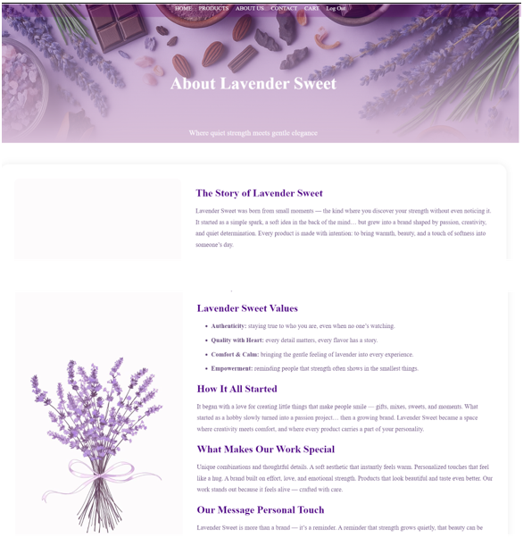
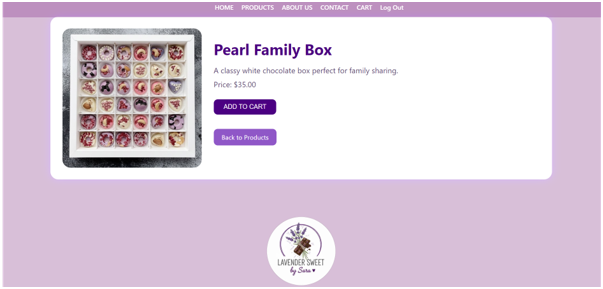
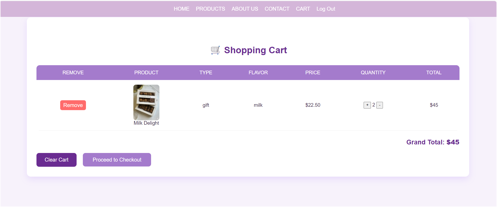
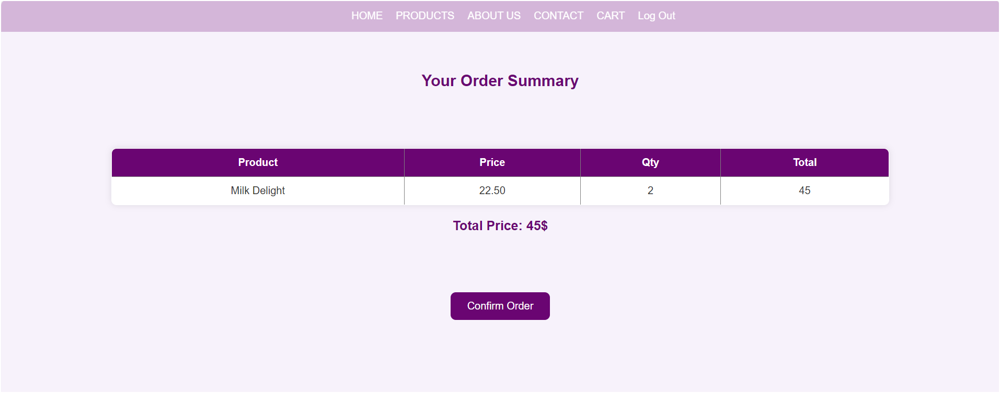

# Lavender Sweet 🍫

**Lavender Sweet** is an elegant and user-friendly e-commerce website for selling chocolate products, built with **HTML, CSS, PHP, and MySQL**.

---

## 🖼 Project Screenshots

### 🏠 Home Page
The main landing page of Lavender Sweet showcasing featured products and promotions.

### ℹ️ About Page
Learn more about the brand and the story behind Lavender Sweet.

### 🍫 Product Page
View product details, images, prices, and add items to the cart.

### 🛒 Cart Page
Manage your selected products before checkout, view totals, and update quantities.

### 💳 Checkout Page
Enter your shipping information and complete the purchase process.

### ✅ Order Success
Confirmation page displayed after successfully placing an order.

### 👤 Signup & Login
User authentication pages for signing up or logging into the website.

### 🛠 Admin Control Panel
Manage products, edit details, or remove items from the store.

## 🗂 Project Structure

- **PHP Pages:** All backend functionality (cart, checkout, products, user profiles, etc.)
- **CSS Files:** Styling for pages and components
- **Images:** Stored in the project folder
- **Database:** `lavender.sql` (contains all tables and sample data)

---

## 🚀 How to Run

1. Place the project folder inside `htdocs` (XAMPP)
2. Start **Apache** & **MySQL** in XAMPP
3. Import `lavender.sql` using **phpMyAdmin**
4. Open your browser and go to:  

---

## 📦 Features

- View chocolate products with details and images
- Add products to cart and manage orders
- User authentication (signup/login/logout)
- Checkout system with order confirmation
- Admin control panel for managing products
- Responsive and clean design

---

## 🖋 Author

**Sara Shehadi**

---

## 🔗 About

An e-commerce platform designed to showcase the **Lavender Sweet** brand, with a focus on simplicity, elegance, and ease of use.

---

## ⚙️ Technologies Used

- **Frontend:** HTML, CSS  
- **Backend:** PHP  
- **Database:** MySQL

---

## 📂 Resources

- `README.md` – project overview  
- `lavender.sql` – database file  
- Images – product and UI images  

---

